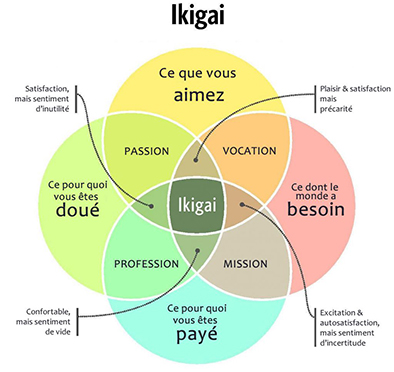

Détentrice d’un CFC de médiamaticienne, j’ai débuté des études en ingénierie des médias pour parfaire mes connaissances dans divers domaines tel que le marketing digital et les technologies web. De plus, à la fin de ces études, le bachelor que j’obtiendrai me permettra de débuter l’enseignement en école professionnelle.
À côté de mes études, je réalise quelques contrats de design, création de sites et illustration. Chose que j’aimerai continuer par la suite en même temps que l’enseignement. Le fait de continuer à travailler en tant qu’indépendant ou dans une petite entreprise en même temps qu’enseigner me permettra de garder un pied dans le monde du travail et de rester à jour.
Ces deux domaines me permettront d’avoir une activité diversifiée et épanouissante pour moi. En effet, j’aime beaucoup créer, mais aussi enseigner mes connaissances et motiver des équipes.

Durant le cours de LabVeilTech, nous avons eu l’occasion de remplir ce que l’on appelle un Ikigai. L'Ikigai est une philosophie de vie qui recouvre en réalité de nombreux domaines de la vie. Mais nous pouvons plus simplement résumé la définition comme suit: « IKI » qui signifie « vie, vivant » ; « GAÏ » qui veut dire « effet, résultat, fruit, valeur, bénéfice »; La traduction littérale donne quelque chose comme « raison d’être ». Pour aider à le trouver, nous pouvons remplir le graphique ci-dessous:

Voici ce que donne pour moi ces 4 axes. Ce que j'aime: Dessiner, créer des visuels, des objets et plein d'autres choses physiques comme virtuelles; Transmettre mes connaissances, aider quelqu'un à atteindre son objectif. Ce dont le monde a besoin: De (bons) enseignants; De la magie, de la folie et du divertissement; D'une meilleure communication. Quelque chose pour lequel je pourrais être payée: Donner des cours; Des commandes d'illustrations; Des créations de sites, identité visuelles, PAO, etc. Ce pour quoi je suis douée: Dessiner (à ce qu'il paraît); Trouver des concepts et idées; Enseigner mes connaissances et passions.

En relation avec mes domaines de prédilection, vous trouverez sur ce site des catégories parlant du graphisme dans sa globalité, du marketing, de la pédagogie ainsi que des technologies, astuces, actualités et tendances dans ces trois domaines.

Bonne navigation et bonne lecture !